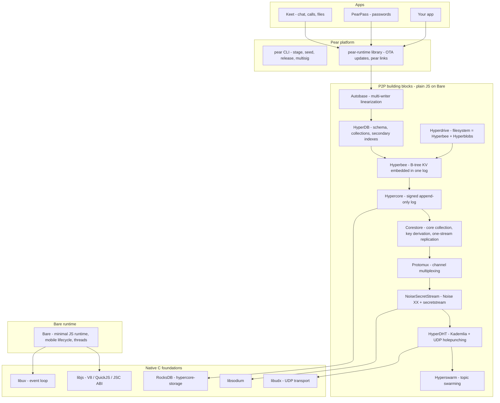

# Pear SDK Architecture & a Rust Equivalent

*Research compiled 2026-07-07 from docs.pears.com, holepunchto GitHub sources, keet.io, tetherto/qvac, and a survey of the Rust P2P ecosystem. All version numbers verified against live sources.*

---

# Part 1 — The Pear / Holepunch stack, mapped

## 1.1 The layer cake



**The single most important design fact:** everything reduces to one primitive — the Hypercore append-only signed log. Key-value stores, filesystems, schema'd databases, and multi-writer structures are all *embeddings into logs*, so replication, sparse sync, integrity verification, and availability only had to be solved once. Even the apps themselves ship as Hyperdrives (`pear://<key>` is a Hypercore key).

Second important fact: the performance-critical parts of this "JavaScript stack" are already native C — libudx (transport), libsodium (crypto), RocksDB (storage since Hypercore 11). The JS layer is orchestration.

## 1.2 Component summaries

### Hypercore (the primitive)
- Append-only log; merkle tree over blocks hashed with **BLAKE2b**, roots signed with **Ed25519**. Flat-tree indexing. Max block ~15MB.
- **Hypercore 11 era**: storage is RocksDB via `hypercore-storage` (auth data, tree nodes, bitfields, user data, cross-core atomic batches).
- **Manifests** (v2): `{ hash, quorum, signers[], prologue, linked[] }` — the core key is the hash of the manifest, making **multi-signer quorum cores first-class**. This is what Autobase's signed checkpoints ride on.
- Fork semantics: monotonic fork ids, `truncate`, `reorgHint` messages for fork healing.
- Sessions/batches: named persisted branches ("like a git branch"), atomic cross-core writes, snapshots.
- **Optional per-block encryption** — the enabler for blind peers (mirrors that store/serve ciphertext they can't read).

### Replication wire protocol
Per connection: `UDX stream → NoiseSecretStream (Noise XX, Ed25519, libsodium secretstream) → Protomux (named channels) → per-core channel`.
- Channel handshake carries a **capability proof derived from the core key** — knowing the discovery key (hash of key) lets you find peers but not read data.
- Messages: `sync`, `request/data` (blocks + merkle path + signature), `want/unwant`, `range`, `bitfield`, `reorgHint`, `extension`. Everything serialized with `compact-encoding`.
- **Sparse by default**: peers request individual blocks/ranges; byte-offset `seek` resolves to blocks with proofs. This is what makes "query without full sync" work at every layer above.

### Networking
- **UDX** (libudx): reliable multiplexed congestion-controlled streams over UDP, deliberately featureless ("no handshakes, no encryption"), plus unordered datagrams, connection migration, stream relaying.
- **HyperDHT**: Kademlia addressed by public key, not IP. Announce/lookup on 32-byte topics; UDP holepunching with relay fallback; mutable/immutable records.
- **Hyperswarm**: topic join (server = announce+accept, client = lookup+dial), auto-reconnect, one connection multiplexes all shared topics, suspend/resume for mobile.

### Data structures over the log
- **Hyperbee**: B-tree *embedded in the log* — tree nodes are log blocks, so a remote peer does O(log n) point lookups fetching only the pages on the path, each verified. CAS, batches, sorted range streams, history/diff streams, watchers, checkouts, sub-namespaces. Being rewritten as **hyperbee2** ("Scalable P2P BTree", active 2025–2026).
- **Hyperdrive**: two linked cores — a Hyperbee for path → metadata and a Hyperblobs core for bytes. `checkout`, `diff`, partial downloads, mirroring. The format Pear apps ship in.
- **HyperDB**: schema-based DB with build-time codegen (hyperschema → generated spec you ship). Collections + **secondary indexes** (unique or mapped, e.g. lowercase-normalized). Same definition runs on two engines: `HyperDB.bee()` (P2P) or `HyperDB.rocks()` (local). Query = `find(index, {gt,gte,lt,lte}, {limit, reverse})` over snapshots.
- **Autobase**: multi-writer. Each writer appends to their own core; nodes causally reference heads forming a DAG; a deterministic linearizer orders them; a user-supplied `apply()` folds nodes into **views** (usually a Hyperbee). On causal forks, views are *undone and reapplied* — apply must be deterministic. A subset of writers ("indexers") advance quorum-signed checkpoints (→ multi-sig manifests, fast-forward for lagging peers). Membership changes happen in-band via `addWriter`/`removeWriter` inside apply; optimistic mode enables open-membership rooms.

### Corestore
Factory + session manager: derives all writable keys from one primary key + names, namespacing, and — critically — `store.replicate(stream)` replicates **all loaded cores over one connection without exchanging keys** (remote must independently hold capabilities; cores attach dynamically as discovery keys are announced).

### Availability: blind peers
`blind-peer` = an always-on replicator that stores/serves encrypted cores **without being able to read them** (block encryption + merkle verification over ciphertext). Client lib load-balances across configured blind peers by XOR distance; can register whole autobases; can trigger push notifications through a gateway without content access. This is Holepunch's answer to "P2P needs someone online."

### Pear platform & distribution
- Apps are Hyperdrives; `pear stage` diffs your working dir into the drive, `pear release` sets a production pointer, `pear seed` keeps it available, `pear run` loads by `pear://` key. **Multisig release gating** (quorum of signing keys) for production channels.
- The platform distributes *itself* the same way — no download server, only a swarm.
- **2025–2026 direction shift**: `pear run` deprecated in favor of the embeddable `pear-runtime` library (any Electron/mobile app embeds P2P OTA), and `pear install` coming. Recommended app shape ("Pear-end"): one portable JS core in a Bare worker owning identity + storage, thin per-platform UI hosts (Electron / native shell + Bare worklet / terminal) over a typed RPC seam.
- **Bare**: not a Node fork — ABI-stable engine bindings (V8, QuickJS, JSC on iOS) + libuv, module system, native addons, threads, and an explicit mobile lifecycle (`suspend/wakeup/resume`) so replication parks sockets when a phone locks.

## 1.3 The search story (the current state, verified July 2026)

There is **no "pear search" product and no first-party full-text engine**. Search today is three threads:

**1. Keet app search (closed-source, app-level)**
| Release | Date | Feature |
|---|---|---|
| v4.1.0 | Jul 2025 | Global user search (usernames/profiles) |
| v4.6.0 | Nov 2025 | In-room message search |
| v4.17.0 | Jun 2026 | Public-room search / room discovery |
| v4.18.0 | Jul 2026 | First QVAC AI integration (on-device DM translation) |

All local: queries scan the locally replicated (Autobase-view) message store, then deep-link to the match. Coverage is bounded by what the device has synced.

**2. Index infrastructure (open, holepunchto)**
- HyperDB secondary indexes + `index-encoder` (composite sorted keys) — **materialized indexes queried by B-tree range scan**. No inverted index, no BM25, nothing matching "fts" in the entire org.
- hyperbee2 rewrite in progress — faster ordered-key scans, the substrate everything indexes on.
- `bare-sqlite` + `bare-sqlite-vector` (May 2026) — embedded SQLite with a vector/ANN extension for purely local search in Bare apps.

**3. The genuinely new thing: replicated vector search (`@qvac/rag`, Tether's QVAC stack)**
- An **IVF (inverted-file) approximate-nearest-neighbor index stored inside HyperDB collections on a Hypercore**: k-means centroids (default 16), bucket rows mapping centroid → doc ids, cosine top-n centroid probing with progressive expansion, hybrid ranking (`0.7·cosine + 0.3·lexical term-coverage/proximity`), reservoir-sampled re-clustering as the corpus grows.
- Because the index lives in a Hypercore, **the index itself replicates P2P** (`replicateWith(core)`); queries run locally against the replicated index.

**The universal pattern: "replicate the index, query locally."** Nothing in the ecosystem does distributed/scatter-gather queries. The closest thing is sparse Hyperbee replication — fetching only the verified B-tree pages a lookup touches. Blind peers can't help with search by design (they can't read the data).

---

# Part 2 — A Rust equivalent, designed for maximum efficiency

## 2.1 The strategic decision: don't port the wire protocol

Every prior Rust Hypercore effort (datrs 2018–2020, revivals 2022–2026) has stalled the same way: Holepunch treats the JS implementation *as* the spec, and rewrote it underneath the porters twice (storage format, tree structure, wire protocol, then v11 manifests). The surviving `hypercore`/`hypercore-protocol` crates deliberately froze at v10 LTS compatibility, bus factor ≈ 1–2, and cannot follow to v11/Autobase. There is **no Rust hyperswarm** — the holepunching DHT, the part that makes Pear "just work," was never finished.

Meanwhile the Rust ecosystem converged on its own substrate: **iroh hit 1.0 in June 2026** (n0, funded team, 11k stars, wire spec being drafted) — ed25519 node IDs as dial addresses, QUIC (quinn fork) with ICE-style NAT traversal per the IETF QUIC NAT-traversal draft, QUIC multipath/migration, relay fallback that *guarantees* connectivity, pluggable discovery (DNS, Pkarr/mainline-DHT, mDNS), BLAKE3/bao verified-streaming blobs, gossip overlays, ALPN-based protocol composition. p2panda validated the "hypercore-shaped logs over iroh" architecture (append-only signed logs, causal ordering, sync — pre-1.0 but shipping in a real app).

**So: rebuild the *shape* of Pear, not its bytes.** Same layer cake, same "one primitive" philosophy, same sparse-verified-replication guarantees — on specified, Rust-native foundations. Wire compat with JS peers is a non-goal (if ever needed, the datrs v10 crates can serve as a read-only compat bridge).

## 2.2 Layer-by-layer mapping

| Pear layer | Rust equivalent | Status |
|---|---|---|
| libudx + HyperDHT + Hyperswarm | **iroh 1.0** endpoint + AddressLookup + gossip — *but see Part 3: iroh's relay dependence fails a fully-serverless requirement* | exists, production (with caveat) |
| NoiseSecretStream | QUIC/TLS (iroh) — same guarantees, better spec | exists |
| Protomux | ALPN protocol routing + per-stream framing | exists |
| Hypercore | **the layer you build**: signed log + BLAKE3/bao merkle + sparse sync | build (~study p2panda) |
| hypercore-storage (RocksDB) | **fjall** (LSM, write-heavy) or **redb** (B-tree, simpler) | exists |
| Corestore | log-store: key derivation (BIP32-ish from one seed), namespaces, one-conn-many-logs replication | build (thin) |
| Hyperbee / hyperbee2 | embedded B-tree over the log (pages as log blocks) — *preserve this design* | build |
| Hyperblobs / Hyperdrive | **iroh-blobs** + a path→entry tree over the log layer | mostly exists |
| HyperDB | schema codegen (serde/prost or hand-rolled compact encoding) + secondary indexes over the B-tree | build (thin) |
| Autobase | deterministic linearizer over writer logs, OR **loro/automerge** CRDTs for doc-shaped state | build / adopt |
| compact-encoding | postcard (serde) or hand-rolled varint codecs | exists |
| Ed25519 / BLAKE2b / libsodium | ed25519-dalek v3, **blake3** + bao-tree, rustls | exists, faster |
| blind peers | encrypted-log mirror node: store/serve ciphertext blocks, verify merkle over ciphertext | build (small) |
| Bare runtime | not needed for a Rust-first SDK; embed via **napi-rs** (Node/Electron), **uniffi** (Swift/Kotlin), WASM (browser), optional **deno_core** for JS apps | exists |
| pear CLI / OTA | drive-based app bundles + release-pointer log + quorum manifest signing | build (later phase) |
| Keet-style search | **tantivy** + vector index — see 2.4, the differentiator | exists (!) |

## 2.3 The core you must own: `log` (the hypercore-shaped crate)

The one genuinely missing piece industry-wide. Design:

```
┌────────────────────────────────────────────────┐
│ VerifiedLog                                    │
│  - append-only blocks, ed25519-signed roots    │
│  - BLAKE3 merkle via bao-tree (outboard)       │
│  - manifest: { signers[], quorum, prologue }   │  ← keep Holepunch's v11 manifest idea:
│  - fork id + truncate + reorg healing          │    key = hash(manifest), multi-sig native
│  - optional per-block encryption (XChaCha20)   │  ← blind mirrors work on ciphertext
│  - sessions / snapshots / atomic batches       │
├────────────────────────────────────────────────┤
│ SyncProtocol (one ALPN on iroh)                │
│  - capability-gated channel open per log       │
│  - sync/want/request/data/bitfield/reorgHint   │
│  - sparse: block, range, and byte-seek proofs  │
│  - one connection replicates N logs (store)    │
├────────────────────────────────────────────────┤
│ Storage: fjall (LSM) — tree nodes, blocks,     │
│  bitfields, user data, cross-log atomic batches│
└────────────────────────────────────────────────┘
```

Choices that differ from Hypercore, deliberately:
- **BLAKE3/bao instead of BLAKE2b flat-tree** — you inherit verified *byte-range* streaming for free (bao-tree is proven in iroh-blobs), it's faster (SIMD, multithreaded), and the outboard format is compact.
- **QUIC streams instead of protomux channels** — one QUIC connection, one stream per replicated log (or a muxed control stream + data streams); backpressure and prioritization come from the transport instead of hand-rolled.
- **Keep**: capability-gated replication (discovery key ≠ read capability), sparse-by-default, fork ids, quorum manifests, per-block encryption, the sessions/atoms model.

## 2.4 The search layer — where Rust doesn't just match Pear, it laps it

Holepunch's ceiling today is range scans + a 16-centroid IVF index with linear rescoring. Rust has **tantivy** (Lucene-class: real inverted indexes, BM25, phrase/fuzzy queries, facets, mmap-based, 15k stars, Quickwit-backed). The design:

**Tier 1 — structured indexes (HyperDB equivalent).** Secondary indexes as composite sorted keys in the embedded B-tree → same sparse remote-lookup property as Hyperbee: a peer can range-query an index it hasn't fully synced, fetching only verified pages.

**Tier 2 — full-text (the differentiator).** Tantivy's `Directory` abstraction lets index segments live anywhere. Store **segments as content-addressed blobs (iroh-blobs), with the segment manifest in the log**:

```
writer:  ingest docs → tantivy IndexWriter → commit
         → new segment files → hash into blob store
         → append {segment_ids, delete_bitmaps, opstamp} to the index log
reader:  follow the index log → fetch segments (lazily, verified ranges
         via bao) → mmap → local BM25 queries
```

- Segment merges are natural in this model: a merge just appends a new manifest entry referencing merged segments; old blobs get GC'd like cleared Hypercore ranges.
- Because bao gives verified *byte ranges* within a blob, a cold reader can serve first queries by fetching only the term-dictionary and posting-list ranges it touches — "sparse full-text replication," which nothing in JS-land can do.
- This preserves the ecosystem's proven pattern (**replicate the index, query locally**) while upgrading the index from B-tree scans to real IR.

**Tier 3 — vector search.** Same segment-shipping pattern with an ANN index (usearch/HNSW per segment, or IVF for direct QVAC parity). Hybrid ranking (BM25 + cosine, reciprocal-rank fusion) is a few lines once both tiers exist — and strictly dominates QVAC's `0.7·cosine + 0.3·term-coverage` scan.

**Multi-writer search** composes: each writer ships their own segment stream; a reader unions N segment sets at query time (tantivy multi-index search), or an Autobase-style linearizer materializes one merged index for big rooms.

## 2.5 Multi-writer: linearizer vs CRDT

Two credible paths — pick per data shape rather than globally:

- **Autobase-style deterministic linearizer** (writer logs → causal DAG → total order → `apply()` into views, quorum checkpoints via multi-sig manifests). Pro: arbitrary state machines, in-band membership, matches the quorum-manifest design above. Con: the undo/reapply machinery is subtle; this is the hardest part of the whole stack to get right (it's also Holepunch's hardest code).
- **CRDTs (loro or automerge — both production-grade Rust, active 2026)** over gossip + logs for document/kv-shaped state. Pro: no reordering machinery, offline-first merges for free. Con: doesn't express "arbitrary apply function" or gated membership as naturally.

Pragmatic call: ship CRDT-backed docs first (covers chat, kv, collaborative state), add the linearizer later only if arbitrary-state-machine views prove necessary.

## 2.6 Runtime & embedding strategy (the Bare analog)

A Rust-first SDK inverts Bare's trick. Instead of a JS runtime with native cores underneath, ship **one Rust core exposed through every FFI seam**:

- `napi-rs` → Node/Electron apps (the pragmatic adoption path — same position `hypercore` npm holds today)
- `uniffi` → Swift/Kotlin for mobile (iroh already ships this way; mobile lifecycle = park the endpoint on suspend, mirroring Bare's suspend/wakeup/resume)
- WASM → browser peers (iroh + iroh-blobs already compile; relay-only connectivity)
- optional `deno_core` host → a true Pear-style "apps are JS, platform is native" runtime, if app distribution becomes a goal

App distribution à la `pear://` is a later phase: app bundle = drive (blob collection + entry tree), release pointer = signed log entry, production gating = quorum manifest. All the primitives are already in the stack by then.

## 2.7 Efficiency: where the Rust stack actually wins

Honest framing first — UDX, libsodium, and RocksDB are C; Holepunch's hot loops aren't slow JS. The wins are structural:

1. **No serialization boundary**: JS↔native crossing (and copies) on every block/crypto/storage call disappears; blocks flow storage→merkle-verify→QUIC as borrowed buffers.
2. **Real parallelism**: BLAKE3 hashing, signature verification, tantivy indexing/search, and compaction spread across cores; Bare gets threads but the JS data structures don't share.
3. **Memory**: no per-isolate JS heap; a mobile/embedded peer or a 10k-core blind mirror runs in tens of MB. (This is the difference between "search runs on the phone" and "search runs on the phone without the OS killing you.")
4. **mmap-native search**: tantivy queries touch page cache, not deserialized JS objects.
5. **One static binary** for seeders/blind mirrors/CLI — no runtime bootstrap, trivial containerization.
6. **QUIC multipath/0-RTT/migration** from iroh — capabilities UDX approximates by hand.

## 2.8 Phased build plan

| Phase | Deliverable | Leans on |
|---|---|---|
| 0 | Spike: iroh endpoint + gossip topic join ≈ hyperswarm demo | iroh |
| 1 | `log`: verified append-only log + sparse sync ALPN + fjall storage; multi-log store & one-conn replication | bao-tree, ed25519-dalek, fjall; study p2panda-core |
| 2 | Embedded B-tree over the log (hyperbee equivalent) + schema'd secondary indexes (HyperDB equivalent) | index-encoder ideas, redb internals as reference |
| 3 | Drive: blob store + path tree; mirror/diff/checkout | iroh-blobs |
| 4 | **Search**: tantivy segments-as-blobs + manifest log; then vector segments + hybrid ranking | tantivy, usearch |
| 5 | Multi-writer: loro-backed docs over gossip; evaluate linearizer need | loro |
| 6 | Blind mirror binary + FFI bindings (napi-rs, uniffi, wasm) | — |
| 7 | App distribution (drive bundles, release pointers, quorum signing) — the "pear CLI" layer | phases 1–3 |

## 2.9 Risks / open questions

- **Fork healing + linearizer complexity**: Autobase's undo/reapply is years of hardening; the CRDT-first plan dodges it but limits the "arbitrary view" story.
- **iroh coupling**: the endpoint API is 1.0-stable, but blobs/gossip/docs are 0.x and iterate; pin and vendor.
- **Discovery decentralization**: iroh's default rendezvous (DNS + Pkarr/mainline) differs from a self-contained Kademlia like HyperDHT; running your own relay+DNS infra or adopting mainline-DHT publishing is a deployment decision, not a code one.
- **No JS interop by default**: if talking to live Pear/Keet peers ever matters, that's a separate compat effort (datrs v10 bridge, or a Bare sidecar).
- **Tantivy on mobile**: works (pure Rust), but segment-merge I/O scheduling under mobile lifecycle constraints needs care.

---

# Part 3 — Addendum: the fully-serverless requirement (2026-07-07 follow-up)

Requirement clarified: the infrastructure must be **fully decentralized and serverless** — no operator-run relays or signaling servers; infrastructure must emerge from the swarm itself, as it does in HyperDHT. This changes the networking recommendation in Part 2.

## 3.1 How HyperDHT actually does it (verified from source, holepunchto/hyperdht main)

**Who serves the DHT (verified in dht-rpc source).** Strictly publicly-reachable nodes. Every node starts *ephemeral* (client-only: can query, announce, connect — but has no wire `id`, never enters routing tables, never appears in lookup results). It upgrades to *persistent* (stores records, answers lookups, forwards signaling) only after ~20 minutes of stability (`STABLE_TICKS = 240` × 5s) **and** passing a reachability self-test: ≥3 of 5 nodes must successfully ping back to its server socket, its NAT-observed port must equal its local port, and its address samples must be consistent. Effectively: open NAT or 1:1 port-preserving mapping only. `ephemeral: false` skips the wait but not the test; there is no supported config that lets a port-rewriting-NATed node serve the DHT.

**Signaling over the DHT itself.** `PEER_HANDSHAKE` (0) and `PEER_HOLEPUNCH` (1) are first-class DHT RPCs. A server's `announce` installs forwarding records on the ~3 (persistent) DHT nodes closest to `hash(publicKey)`; those nodes forward the client's Noise handshake and subsequent punch-coordination rounds to the server (`lib/router.js`, relay-hop modes FROM_CLIENT/FROM_RELAY/FROM_SECOND_RELAY).

**How a forward reaches the NATed server: existing-mapping reuse.** The announce record stores `relay: req.from` — the server's NAT-observed address *toward that specific node*, i.e. the mapping minted by the server's own announce packet. The server's `Announcer` then **pings each of its ~3 announce-relay nodes every 3 seconds** (re-announcing every ~5 min, immediately if fewer than 3 answer), holding those NAT mappings open. A forwarded handshake is sent from the relay node's own socket to that stored address — arriving from exactly the node:port the server pings, so the server's NAT admits it. Symmetrically, the final `REPLY` to the client is emitted by the node the client originally contacted (clients validate reply source = request destination), so the *client's* NAT path also stays coherent. The two-hop `FROM_SECOND_RELAY` mode exists precisely to satisfy both constraints at once when the client's entry node isn't one of the server's announce relays: hop 1 anchors the client's reply path, hop 2 owns the live mapping into the server. So NATed peers *do* participate in the signaling chain — as its endpoints, reachable over mappings they maintain themselves — but the forwarding middle is always persistent, publicly-reachable nodes. The punch rounds are **encrypted under a secret derived from the completed Noise handshake** (`SecurePayload`, `hs.holepunchSecret`) — coordinating DHT nodes can't read the NAT gossip, let alone the session. Address integrity comes from **token echo**: each side only punches toward addresses the relay node actually *observed* (`token = payload.token(peerAddress)`, `verified` on echo), blocking spoofed-address reflection.

**NAT classification by swarm sampling** (`lib/nat.js`): ping ≥4 distinct DHT nodes on the same socket; each pong reports your external address as seen. Same ip:port from ≥3 nodes → CONSISTENT; all-different ports → RANDOM; not firewalled → OPEN. Frozen during negotiation; up to 3 socket-reopen retries to "coerce into consistency" (mobile/CGNAT churn).

**The birthday-paradox punch** (`lib/holepuncher.js`), strategy by (local, remote) NAT pair:

| local | remote | strategy |
|---|---|---|
| CONSISTENT | CONSISTENT | direct simultaneous probe of known addresses |
| RANDOM | CONSISTENT | open **256 sockets** (`BIRTHDAY_SOCKETS`), each firing one **TTL-5** packet (dies in transit — exists only to allocate an external port on the local NAT), then keep-alives across all holders |
| CONSISTENT | RANDOM | **spray**: 1750 punches at random ports (`1000 + rand·64536`), 20ms apart (~35s) |
| RANDOM | RANDOM | **refuse** → relay fallback (`HOLEPUNCH_DOUBLE_RANDOMIZED_NATS`) |

Expected collisions for the one-sided case ≈ 1750 × 256 / 64536 ≈ 6.9 → **~99.9% success** within the window (derived from in-code constants). Punch packets are 1 byte (`[0]`); the socket pool demuxes punches from DHT traffic by size. Node-wide throttle: **one** random punch in flight, ≥20s apart (`_randomPunchLimit=1`, `_randomPunchInterval=20000`, `TRY_LATER` back-pressure) — the abuse limit on the expensive path.

**Fallback data relay is also a peer**: `relayThrough` names any volunteer peer running `blind-relay` — token-paired stream bridging, blind to content (E2E Noise), with continuous **direct-upgrade**: a 0-byte UDX probe keeps trying the direct path and tears down the relay when a late punch lands (`lib/relay-connection.js#confirmDirectUpgrade`).

**Trust model**: DHT nodes are selected by Kademlia proximity, not trust — safety is E2E crypto + token echo + signature-verified announces (ed25519 over `target|id|token|peer`). Bootstrap nodes (`node1-3.hyperdht.org`) are non-privileged entry points; any node can bootstrap a fresh DHT. Known gap (TODO in router.js): per-node rate limiting of signaling RPCs.

## 3.2 What iroh 1.0 actually offers — and doesn't

**Relays are load-bearing for three functions, not one:**
1. **Punch signaling**: iroh's NAT traversal (draft-seemann-quic-nat-traversal, in their quinn fork `noq`) exchanges candidates and punch triggers as **QUIC frames in-band on an already-established path** — for two NATed peers, that path *is* the relay. Docs: "Both peers first connect to a shared relay server."
2. **Reflexive address discovery**: relays host the QUIC address-discovery (QAD) endpoint; with `RelayMode::Disabled` an endpoint never learns its public ip:port, so it has nothing to advertise even if you exchange candidates out of band.
3. Fallback transport.

Maintainer, verbatim (issue #2567, open since 2024, not on roadmap): *"Without a relay server you will not be able to holepunch. `RelayMode::Disabled` is for when you can establish a direct connection without holepunching."*

**No hard-NAT traversal at all**: no port prediction, no birthday probing anywhere in iroh or noq (code + issue search). Symmetric NAT → relay. Issue #4134 (open): one-side-symmetric pairs that punched under the old disco protocol now stay on relay — a regression. n0 claims ~9/10 network pairs punch.

**Decentralization posture**: Pkarr/mainline-DHT lookup carries only static signed records (relay URL + addrs) — publish/poll, can't carry signaling; with no relay configured it publishes empty records by default (#3810). Relays are not federated or discoverable; must be publicly-reachable HTTPS servers (embeddable in-process since 0.97, via Holochain's contribution, but a NATed peer cannot volunteer). n0's business model is managed relays (~$197/relay/mo) — architectural gravity points toward more relays, not fewer. p2panda and Holochain both *self-host* relays rather than eliminate them. Nobody runs iroh relay-free with punching.

**Could DHT-coordinated punching be grafted on without forking?** Partially. The `unstable-custom-transport` hook could tunnel datagrams through volunteer peers; once a peer-forwarded path exists, in-band QNT signaling flows and native punching proceeds (a maintainer sketched exactly this in discussion #4035). But you'd still have to build reflexive-address discovery from peers, the volunteer overlay itself, and abuse limits — months of work riding an API n0 says stays unstable past 1.0. And the **birthday technique is likely fork territory regardless**: it requires a pool of many local UDP sockets each minting a NAT mapping, which conflicts with iroh's single-socket QUIC endpoint model — punch scheduling lives inside noq, not behind any public hook.

## 3.3 Revised recommendation: own the swarm layer

Three options, honestly priced:

| Option | Serverless? | Effort | Verdict |
|---|---|---|---|
| **A. Stock iroh + self-hosted relays** | No — relays are servers you run | ~0 | Fine for most products; fails the stated requirement |
| **B. iroh + custom volunteer-peer transport** | Mostly — punch signaling via peers; still no hard-NAT punching (birthday needs a noq fork) | months, on unstable APIs, first-of-its-kind | Poor risk/reward: you do the hard part anyway but don't control it |
| **C. Own swarm crate with HyperDHT semantics** | Yes — identical model to Pear | the hard ~20% of the stack, but now **fully specified** (§3.1 is the port spec) | **Recommended** |

Option C concretely — a `swarm` crate replacing the iroh endpoint in the Part 2 design:

- **Kademlia DHT** where every non-NATed participant is a routing/signaling node (port of `dht-rpc` semantics); ed25519-signed announces; 32-byte topic announce/lookup; bootstrap = any known node, ship none by default.
- **Signaling RPCs** (`peer_handshake`, `peer_holepunch`) forwarded by the nodes nearest the announce target; punch payload encrypted under the handshake-derived secret; token-echo address verification. (Rust bonus: per-node rate limiting from day one — the thing hyperdht still has as a TODO.)
- **NAT sampler + puncher**: swarm-sampled classification, then the strategy table from §3.1 verbatim — 256-socket TTL-5 birthday side, 1750-probe spray side, refuse double-random, global random-punch throttle. This is a socket-pool design (tokio + socket2), naturally at home in Rust.
- **QUIC on punched paths**: after the 1-byte punch lands, hand the socket pair to **quinn** (custom `AsyncUdpSocket`) — punch decides *who can talk*, QUIC provides streams, migration, and TLS on top. (Alternative: a UDX-like custom reliable layer; not worth it — quinn is battle-tested.)
- **Volunteer blind relay**: token-paired stream bridging for the unpunchable ~few %, E2E-encrypted, with the 0-byte direct-upgrade probe. Same binary as the blind mirror from Part 2 — one volunteer node type serves storage *and* connectivity.
- **Port mapping (UPnP / NAT-PMP / PCP) — a cheap improvement over hyperdht.** Verified: the Holepunch stack uses none of these (no such dependency in hyperdht, dht-rpc, hyperswarm, or udx; org-wide code search finds only incidental lockfile entries in example apps). They rely purely on punching + the strict open-NAT persistence test — which means only natively-open-NAT machines can serve the DHT. iroh, libp2p, and Tailscale all ship port mapping (n0 publishes a standalone `portmapper` crate: UPnP + NAT-PMP + PCP). Integrating it in the swarm crate upgrades many home peers to persistent-eligible: attempt a mapping at startup; on success the node has a stable public ip:port and can pass persistence checks. One protocol tweak required vs the hyperdht port: dht-rpc's persistence test demands external port == local server-socket port (a "no NAT" heuristic); a design that instead requires only a *stable, verified* external mapping (re-probed periodically, mapped-port renewal per PCP lifetimes) accepts mapped peers too. More persistent nodes → more DHT capacity, more punch coordinators, and more directly-dialable peers — compounding for a video platform where long-uptime desktop watchers can quietly become backbone.
- **Keep from the iroh ecosystem what's genuinely standalone**: `bao-tree` (verified byte-range streaming — no iroh dependency), blake3, quinn itself. Drop iroh-blobs/gossip (endpoint-coupled); the blob protocol and a plumtree-style gossip are thin layers over the swarm crate.

Everything else in Part 2 — the verified log, embedded B-tree, drive, tantivy/vector search, CRDT multi-writer, FFI strategy — is unchanged; only the substrate row swaps. Phase plan delta: phase 0/1 becomes the `swarm` crate (DHT + NAT sampler + puncher + quinn integration), which front-loads the riskiest work — appropriate, since it's also the requirement the whole design now hinges on.

Why this is less scary than it was for datrs: they were chasing an unspecified moving target for *wire compatibility*. Here the goal is the *mechanism*, now extracted and documented (§3.1), with no compatibility constraint — and the mechanism is stable: hyperdht's punch design hasn't materially changed in years because NAT physics doesn't change.

## 3.4 Reality check: who actually runs the hyperdht backbone? (added 2026-07-08)

Double-verification of the "volunteer public-node DHT" story, prompted by the fair question: *can this actually work in the wild, or does Holepunch run the persistent nodes themselves?*

**Code (verified first-hand in dht-rpc index.js):** the persistence gate is even stricter than "open NAT." `_checkIfFirewalled` requires *unsolicited* inbound UDP to a server socket that has never sent outbound traffic — normal full-cone NATs only create mappings on outbound packets, so they fail. Persistent-eligible ≈ public IPs, VPSes, static port-forwards, DMZ. Laptops are demoted to ephemeral on every sleep/wake (`_onwakeup`), and re-promotion takes ~60 min (`MORE_STABLE_TICKS`). An in-code TODO acknowledges there's no opt-in for stable-but-remapped ports.

**Empirical composition: nobody knows — literally no data exists.** No academic measurement study of the Hyperswarm DHT exists (unlike Mainline DHT or IPFS); no Holepunch statement gives a node count; and their monitoring stack (`instrumented-dht-node`, `dht-prometheus`, Grafana dashboards) measures *their own fleet*, not the network — there is no crawler.

**What Holepunch verifiably runs:** the 3 bootstrap nodes (Hetzner + 2× DigitalOcean, per constants.js), an instrumented monitoring fleet (you don't build Docker images + a Prometheus bridge for nodes you don't run), TURN-style `blind-relay` servers (an actively maintained, load-bearing path — 2025–26 commits are dominated by relay fixes), `blind-peer` store-and-forward servers with `DEFAULT_BLIND_PEER_KEYS` baked into the client, and push gateways. "Keet is 100% serverless" is marketing; the repos contradict it — the servers just aren't called servers.

**Aggravating trends:** no IPv6 (issue #1, open since Oct 2018 — as CGNAT spreads, the IPv4 open-NAT pool shrinks and IPv6-capable hosts can't help); Keet's userbase is mobile-heavy (structurally ineligible); Play Store shows ~500K+ downloads — after the open-NAT × 30-min-uptime × desktop filter, the plausible volunteer persistent population is small.

**The mechanism itself is proven, though — just at different scale.** BitTorrent Mainline DHT runs the identical model (only publicly-reachable nodes route; NATed nodes measured as *harmful* in routing tables — the 2011 quarantine work and BEP 43 read-only nodes are the same lesson hyperdht designed in) at 15–27M measured concurrent users, fully volunteer (Wang & Kangasharju, IEEE P2P 2013). MLDHT works because hundreds of millions of installs × a few percent reachable still yields a huge router population. hyperdht's participant pool is 2–3 orders of magnitude smaller *before* the filter.

**Verdict:** the architecture is sound and honest (NATed peers can't hurt routing); the *population* story is unproven, and every observable trend pushes load toward operator-run infrastructure. Design consequences for us: (1) a video platform is actually the favorable case — it naturally recruits BitTorrent-shaped desktop/seedbox peers rather than phones; (2) widen persistence eligibility aggressively (port mapping §3.3, IPv6 from day one, accept stable verified remapped ports); (3) build network measurement in from the start (a crawler + composition telemetry — never fly blind on "is the volunteer backbone real"); (4) be honest that bootstrap-era backbone nodes are operator/community-run, and design them as commodity, federated, unprivileged — the goal is that the network *can* outgrow them, verifiably.

## 3.5 Additional sources (Part 3)

- hyperdht source: lib/{router,holepuncher,nat,connect,server,announcer,persistent,socket-pool,relay-connection,messages,constants}.js · github.com/mafintosh/dht-rpc · github.com/holepunchto/blind-relay · deepwiki.com/holepunchto/hyperdht/3.2-nat-traversal
- iroh: docs.iroh.computer/concepts/{nat-traversal,relays,address-lookup} · iroh.computer/blog/{iroh-0-96-0…, iroh-0-97-0…, v1} · issues #2567, #4134, #3810, #2917 · discussions #4035, #4220 · github.com/n0-computer/noq (#567, #607) · draft-seemann-quic-nat-traversal · draft-ietf-quic-address-discovery · iroh.computer/pricing

# Part 4 — Building blocks for a P2P video platform (the actual target)

Goal restated: a YouTube-like system for non-copyrighted content — publish, discover, stream, comment — fully serverless per Part 3.

## 4.1 Can Hypercore be implemented in Rust? Yes — and it's the *bounded* part

The core of Hypercore is small and stable: an append-only block store, a merkle tree over it, Ed25519 root signatures, a bitfield, and a sparse sync protocol. datrs proved feasibility years ago (their v10-compatible crate works; it stalled on *wire-compat chasing*, not difficulty). Freed from wire compat (Part 2 decision), a Rust `log` crate is a few-thousand-line, well-specified project:

- blocks + BLAKE3/bao merkle (bao-tree crate, standalone) + ed25519-dalek root signatures
- manifest (quorum/multi-signer, prologue) — keep the Hypercore 11 idea
- storage on fjall/redb; bitfields; sessions/snapshots
- sync protocol over swarm-crate QUIC streams: sync/want/request/data + proofs, fork ids
- optional per-block encryption (for blind mirrors) — for *public* video content, mostly unused

**But for video, the log is the wrong primitive for the bytes.** Hypercore conflates two shapes that a video platform should separate:

| Shape | Right primitive | Why |
|---|---|---|
| **VOD video bytes** (immutable once published) | **Content-addressed blob** + bao verified byte ranges | Seeking = verified range request; dedup across re-uploads; no signature/fork machinery needed for immutable data; any peer can serve any range with proofs |
| **Mutable/append state** (channels, live streams, comments) | **Signed append-only log** | Authorship, ordering, updates, subscriptions = following a log |

Holepunch reached something similar internally (Hyperdrive = a Hyperbee log for metadata + a Hyperblobs core for bytes). We make the split explicit and give the blob side a real download scheduler.

## 4.2 The layer stack for "P2P YouTube"

```
┌─────────────────────────────────────────────────────┐
│ App: player UI, publish flow, subscriptions          │
├─────────────────────────────────────────────────────┤
│ social: comments/reactions (per-user logs + rooms)   │
│ search: tantivy segments-as-blobs + indexer peers    │
│ channel: author log — profile, video manifests       │
│ media: CMAF packaging, rendition ladder, ABR         │
├─────────────────────────────────────────────────────┤
│ blob: content-addressed store, bao ranges,           │
│       piece scheduler (playback-deadline + rarest)   │
│ log: signed append-only log + sparse sync            │
├─────────────────────────────────────────────────────┤
│ swarm: DHT, NAT traversal (Part 3), quinn QUIC       │
│ store: fjall, key derivation, namespaces             │
└─────────────────────────────────────────────────────┘
```

### blob — the workhorse
- Content-addressed by BLAKE3 root; **bao outboard** gives verified byte ranges, so a peer that has *any* verified range can serve it onward immediately (peers become seeders mid-download — BitTorrent economics).
- **Piece scheduler is the video-specific engineering**: two-band priority — a *playback window* (next N seconds of the active rendition, deadline-scheduled, duplicated requests near deadline) and *background* (rarest-first across the swarm for the rest). This is the Popcorn-Time/BitTorrent-streaming lesson: sequential-only kills swarm health, rarest-only kills startup latency; the two-band hybrid gets both.
- Swarm topic per video (`hash(video_id)`), so watchers of the same video find each other directly.

### media — packaging determines P2P performance
- **CMAF/fMP4, GOP-aligned segments (~2–4s)**: seek targets and range boundaries coincide with keyframes; a range request never yields undecodable bytes.
- **Rendition ladder** (e.g. 360p/720p/1080p + audio-only): each rendition is its own blob; the **manifest** (a small struct: rendition → blob hash, byte offsets per segment, codecs, duration, thumbnails hash) is what the channel log entry points at. ABR = client switches which blob it schedules from the playback window — no server logic, identical to HLS/DASH but with hashes instead of URLs.
- Transcoding happens at publish time on the *publisher's* machine (ffmpeg; Rust bindings) — the honest cost of serverlessness. Optional later: volunteer transcode peers (submit source blob, receive rendition blobs, spot-check by re-encoding random GOPs).
- **Live streaming**: an append-only log of CMAF chunks (this is what Hypercore was literally designed for). Watchers follow the log's live edge (`sync` messages announce new length); the same two-band scheduler with the window pinned to the edge gives low-latency live. After the stream ends, seal the log into a VOD blob + manifest.

### channel — identity and publishing
- Channel = an Ed25519 keypair; the channel **log** carries: profile updates, video-published entries (manifest hash + title/description/tags/thumbnail hash), deletions/tombstones (a request, not an enforcement — immutable-log reality), and optionally quorum manifests for multi-maintainer channels.
- Subscribing = following the log: swarm-join its discovery topic, sync new entries, fetch thumbnails eagerly and video bytes lazily. The subscription home feed is a purely local join over followed logs.

### search & discovery — the tantivy layer earns its keep here
- **Followed-channel search** (baseline, trivial): each client indexes metadata of subscribed channels locally in tantivy. Zero trust issues.
- **Global discovery** (the hard problem — YouTube's search is a server): **indexer peers** — any volunteer can crawl channel logs it learns of (via DHT announces, gossip, other indexes), build a tantivy index of *metadata only* (titles/tags/descriptions, tiny relative to video), and publish it as segments-as-blobs under the indexer's own log (Part 2 §2.4 mechanism, unchanged). Clients pick indexers like they pick DNS resolvers — subscribe to a few, union results, diversity defends against index bias. Bootstrap reality: you (and anyone) run indexer peers as ordinary volunteer nodes; they're replaceable, content-verifiable (every result carries the channel key + log entry it claims to come from — **fake entries are detectable because search results are provable log references**), and hold no privileged position.
- Tag/topic rendezvous: DHT topic per tag for "browse #rustlang" without any index at all.
- Sybil caveat (honest): ranking (view counts, trending) is unverifiable in open P2P — treat popularity signals as per-indexer editorial opinion, not ground truth. Web-of-trust ranking (weight by subscription-graph distance) is credible future work.

### social — comments, reactions
- Two workable models: (a) **per-user logs + aggregation**: each user's comments live in their own log; per-video rooms are assembled by indexer peers or by the watcher's client following participants — simple, spam-resistant by default (you see comments from your follow-graph + chosen indexers); (b) **room logs**: a multi-writer room per video (CRDT or autobase-style), open-membership — richer but inherits the moderation problem. Ship (a) first; it composes from existing pieces.

### availability
- Watchers seed what they watched (configurable cache budget) — popular content is self-sustaining, exactly like BitTorrent.
- Long tail: **volunteer mirror nodes** — same node type as Part 3's blind relay + Part 2's blind mirror; for public content "blind" encryption is unnecessary, so a mirror is just a big-disk peer pinning channels it elects to support. Publishers can also run their own mirror (a Raspberry Pi seeding your channel ≠ a server dependency; the network works without it).

### moderation (unavoidable design surface, even for non-copyrighted content)
- No global delete exists — design honestly around it: **subscribable moderation logs** (blocklists/allowlists published by moderators-as-channels); clients and *especially indexer and mirror peers* choose which to apply. Mirrors dropping a blocklisted video removes long-tail availability; watchers dropping it removes reach. Moderation becomes a market of filters rather than a central authority — the only model that's coherent with the serverless requirement.

## 4.3 What changes vs the Part 2 plan

Phases re-anchored to the video MVP:

| Phase | Deliverable |
|---|---|
| 0–1 | `swarm` crate (Part 3) — unchanged |
| 2 | `blob` (bao ranges + two-band scheduler) + `log` (channel feeds) — *swapped ahead of the B-tree; video needs blobs before databases* |
| 3 | `media` (CMAF packaging, manifests, ABR) + CLI: `publish <file>` / `watch <channel/video>` — **end-to-end demo milestone** |
| 4 | channel/subscription layer + local tantivy search |
| 5 | indexer peers + segments-as-blobs global search; mirror node binary |
| 6 | comments (per-user logs), moderation logs; live streaming |
| 7 | FFI + GUI apps |

The B-tree/HyperDB analog (Part 2 phase 2) demotes to a utility for indexer/mirror internals — a video platform's hot path never touches it.

## 4.4 Prior art worth studying (and why each fell short)

- **PeerTube** — federated, not P2P: servers host video; WebTorrent assists popular streams. Proves demand; its instance-hosting cost is exactly what the mirror/watcher-seeding design removes.
- **BitTorrent streaming / Popcorn Time** — source of the two-band scheduler; no channels/search/identity.
- **IPFS video** — content addressing without a streaming-aware scheduler or verified ranges at useful granularity; seek performance was chronically poor.
- **LBRY/Odysee** — content registry on a blockchain (cost/complexity we avoid; a DHT + signed logs covers registry needs), but validated channel-key identity + content addressing at YouTube-ish scale.
- **Dat/Hypercore video demos (mafintosh, ~2017)** — sparse-seek video over hypercore worked a decade ago; the primitive is proven, the platform around it was never built.

## 4.5 Phones as first-class clients (not DHT nodes)

Requirement: full watch/publish experience on iOS/Android; phones never serve the DHT (they're structurally ineligible anyway — CGNAT, backgrounding, battery).

**Role model.** Three node profiles from one codebase:
| Profile | DHT | Serves data | Typical host |
|---|---|---|---|
| **backbone** | persistent router | mirror + relay + indexer + announce-proxy | VPS, seedbox, port-forwarded desktop |
| **desktop peer** | ephemeral, auto-promotes if eligible | seeds watched content | laptop/desktop app |
| **mobile peer** | ephemeral client only | optional WiFi+charging seeding | iOS/Android via uniffi |

**Why video-on-phones is easier than chat-on-phones (Keet's problem).** A phone watching video mostly connects to *reachable* peers — mirrors, seedboxes, promoted desktops — so no punching is needed at all: direct dial to a public address. Punching only matters phone↔NATed-desktop (one-sided, birthday machinery handles it), and phone↔phone (double-random cellular → volunteer relay) is a rare path for video consumption. Contrast Keet, where phone↔phone *is* the product.

**Battery discipline (the Bare suspend/resume lesson, applied):**
- Foreground-driven networking: swarm up while watching/browsing, parked on background. No persistent background connections on iOS anyway — design for it rather than fight it.
- No periodic announce traffic from phones. hyperdht's 3-second keepalive pings are radio poison; instead, **announce by proxy**: a backbone node announces on the phone's behalf (the pattern already proven by Holepunch's `blind-peer --trusted-peer`). A phone publisher's channel stays discoverable while the phone sleeps.
- Prefetch-then-idle scheduling: on good networks, fill the playback buffer in bursts and let the radio sleep, rather than trickling (the two-band scheduler gets a mobile mode: deeper playback window, no background rarest-first on cellular).
- Push (new comments, subscriptions) via a blind push gateway — the one unavoidable notification server, same as Keet's.

**Publishing from a phone.** Two viable paths, ship both:
1. **On-device renditions**: phones have hardware encoders (VideoToolbox / MediaCodec) — producing a 2–3 rung ladder of a typical clip is genuinely feasible and keeps publishing serverless.
2. **Delegate to your own backbone/desktop**: upload the source blob to a mirror you control (or your desktop at home), which transcodes and appends the manifest with your channel key via a signed request. Better for long videos and battery.
Either way the phone only needs to stay online until one other peer has the blobs — then availability is the mirror/watcher swarm's job.

**Rust mobile reality:** the whole stack (tokio, quinn, blake3/bao, fjall, tantivy) compiles for iOS/Android; bindings via uniffi; the socket-pool puncher works on both platforms. The mobile-specific engineering is lifecycle (suspend/resume hooks mirroring Bare's) and the radio-aware scheduler mode — design them into the swarm and blob crates from the start, not as retrofits (Holepunch got this right; it's why Bare exists).

## 4.6 Future-proofing: growing the minimal log into the full Hypercore-equivalent

The video MVP needs only a slim log (an authenticated, ordered feed of channel events). The full Part 2 §2.3 log — embedded B-trees, HyperDB-style indexes, sessions, multi-writer quorum — can be added later *without re-architecting*, if four decisions are locked in now:

1. **Address every mutable structure by manifest hash, not raw public key** (the Hypercore 11 move). `structure_id = hash(manifest { version, signers[], quorum, kind, ... })`, even while v1 only implements single-signer. Identity is the one thing that can't be migrated — links, subscriptions, and DHT announces all hang off it. With manifest addressing, multi-signer channels and autobase-style views later reuse the same identity, discovery, and capability scheme.
2. **One proof plane for blobs and logs.** Verify log blocks with the same BLAKE3/bao machinery as blob ranges. Then a log is "an append protocol + signature chain + tree head *over* the blob plane," and the sync engine (want/have/request/data + verified ranges) is written once, generic over verified structures. This is what makes the log additive: the hard 80% (verified sparse transfer) already exists from phase 2.
3. **Versioned, extensible wire protocol.** Sync messages as versioned enums with reserved extension space; unknown-message tolerance specified from day one (hyperdht's `interrupt`/upgrade lesson). Adding log-specific messages (upgrade proofs, fork/reorg hints, bitfields) then extends the protocol instead of forking it.
4. **Storage with cross-structure atomic batches** (hypercore-storage's "atoms"): fjall keyspace namespaced per structure, with multi-structure write batches in the API surface now. Embedded B-trees and indexer state later need atomic "append block + update index + move head" commits; retrofitting atomicity into a per-structure API is a rewrite.

Reserve-but-don't-build: fork ids + truncate semantics in the log header encoding (a few bytes now, fork-healing later), and a `kind` field in manifests distinguishing plain-log / B-tree / view so future structure types are self-describing.

With those four in place, the growth path is strictly additive — the same path Holepunch themselves walked (Hypercore 10 → 11 manifests without breaking replication; Hyperbee layered on an unchanged log). The slim log ships with the video platform; the database layer arrives when indexer peers or richer apps demand it.

## Appendix — sources for Parts 1–2

- docs.pears.com (stack, storage & distribution, bare, blind peering, CLI) · github.com/holepunchto/{hypercore, hypercore-storage, corestore, hyperbee, hyperbee2, hyperdrive, autobase, hyperdb, hyperswarm, hyperdht, udx-native, protomux, blind-peer, bare-sqlite-vector} · pears.com/news/pear-evolution
- Keet: keet.io, support.keet.io, github.com/holepunchto/keet-mobile-releases CHANGELOG
- QVAC: github.com/tetherto/qvac (packages/rag — HyperDBAdapter IVF implementation), docs.qvac.tether.io
- Rust: github.com/n0-computer/iroh (1.0, Jun 2026) · datrs/{hypercore, hypercore-protocol-rs} · p2panda.org · tantivy (quickwit-oss) · loro.dev / automerge.org · fjall / redb · bao-tree / blake3 · napi.rs / mozilla/uniffi-rs
