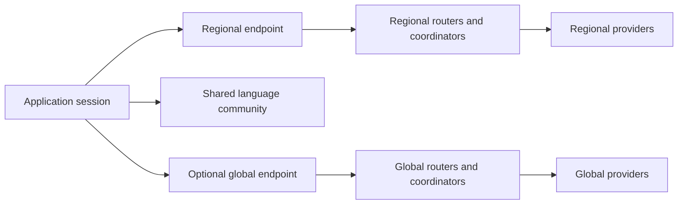

# Regional DHTs that survive international disconnection

## Objective

A region must keep discovering providers, coordinating direct connections, and
joining through invitations after international connectivity disappears. Returning
clients must restart from regional contact hints. Operation must continue beyond
routing and registration expiry, rather than depend on stale global records.

Device language can now select a community automatically. An optional local network
domain adds independently maintained local discovery beneath that community, and an
optional global endpoint provides international discovery. Locale never selects a
country or supplies bootstrap addresses. Arbitrary partitions are not automatically
turned into new overlays.

## Language selection and local redundancy

`community::Community::detect` uses native preferred locales through
[`sys-locale`](https://docs.rs/sys-locale/0.3.2/sys_locale/). Applications can instead
supply their ordered locale list to `Community::select`, useful for app-specific
language settings and Android's full preference list (the native dependency's
Android implementation reads the system locale property).

Selection precedence is **explicit choice > invitation > saved choice > first valid
preferred locale**. `fa`, `fa-IR`, `fa-AF`, and `fa_Arab_IR.UTF-8` all select the same
Farsi community. Language tags are validated and canonicalized with
[`language-tags`](https://docs.rs/language-tags/0.3.2/language_tags/); script, territory
and formatting extensions do not split communities. Private-only, undetermined,
invalid and missing preferences do not silently fall back to English. A usable
invitation or explicit choice is required in that case.

`store::load_or_select_community(data_dir, explicit, invite)` atomically saves the
selected community to `community.json`. Subsequent starts read it without querying
the device locale. Corrupt state is reported rather than silently reselecting;
an explicit choice or invitation can replace it. Invitations supply language
metadata in their version-2 format; old version-1 invitations retain their opaque
overlay selection. Persisted communities are versioned and validate that the saved
language agrees with the saved overlay identifier.

Language communities do not themselves guarantee shutdown survival. For that,
configure a `ConnectivityDomain` independently, with a stable domain label and
reviewed IPv4/IPv6 CIDR ranges. The local overlay is derived from **both the
community ID and domain label**. Its entire DHT transport rejects outside addresses,
including packets bearing the correct overlay ID and outbound attempts to outside
referrals. Handshake verification and existing prefix diversity still apply within
the permitted ranges. Range matching uses merged intervals and binary search;
IPv4-mapped IPv6 peers use the IPv4 policy.

No ranges are inferred from locale, device region settings, language demographics,
or RTT. The application supplies and updates its network-range data. Country IP
allocation is only an approximation of paths that survive together: this mechanism
cannot prove domestic routing, defeat a malicious approved participant, or repair
provider-level partitions. A changed policy requires rebinding a new endpoint with
the new policy; existing endpoints keep their construction-time policy.

With a local domain configured, there are three independent endpoint roles:

| Role | Membership selector | Address policy |
| --- | --- | --- |
| Local | Language/community ID + connectivity-domain label | Configured local ranges |
| Community | Language/community ID | Overseas and domestic participants allowed |
| Global (optional) | Existing global DHT | Existing behavior |

Without a local domain, the primary endpoint is the language community itself.
That mode provides community discovery but **does not promise domestic redundancy**.
The `OverlayId::Regional` Rust variant is a historical name for any scoped overlay,
including language communities; the existing scoped wire encoding is reused.

```rust,ignore
use warren::{community::ConnectivityDomain, regional::RegionalNode, store};
let choice = store::load_or_select_community(data_dir, explicit_choice, invitation)?;
let domain = ConnectivityDomain::new("ir/v1", reviewed_domestic_cidrs)?;
let node = RegionalNode::bind_community(
    local_bind, Some(community_bind), Some(global_bind),
    persisted_identity, false, &choice, Some(&domain),
).await?;
// Supply separate local/community/global hints, or join a compatible invitation.
// A language identifier never acts as a bootstrap address.
let renewals = node.keep_announced_all(interval, move || topics()).await;
// Keep every handle alive and inspect its independent status().
let results = node.lookup_all_overlays(topic).await;
```

Use `keep_announced_all` and `lookup_all_overlays` for community deployments.
The older `keep_announced` and `lookup_all` methods preserve their primary/global
pair return types and do not include the third community endpoint. Normal
`Network::lookup`, `dial`, `announce`, and `incoming` handle all configured endpoints
with independent workers and budgets. Incoming queues are polled round-robin.
One-shot announcement success still means the primary endpoint acknowledged it;
secondary announcements are bounded best effort.

Try native locale selection without opening sockets:
`cargo run -p warren --example community`. Pass `fa-IR` to inspect an explicit choice.

## Architecture



`Session<regional::RegionalNode>` implements the existing `network::Network`
contract. Each process has a primary `NextNode`, an optional shared community
`NextNode`, and an optional global `NextNode`, using the same authenticated identity
but different UDP sockets. Each owns its complete DHT key space, routing table, provider-key cache,
coordinator registrations, maintenance tasks, connection budget, and request queue.
Incoming authenticated connections have separate bounded queues (32 each).

The same topic or content key can be advertised independently in every overlay. Providers make
fresh coordinator-bound registrations in each overlay; the implementation never
copies registrations or routing referrals between overlays. Dual participation
does not create a gateway that either overlay needs to operate. Global records
and global addresses are not imported into regional routing state.

The original seed can be outside the region during network formation. If it
participates in the regional overlay, however, it remains discoverable through
that overlay's ordinary referrals while present. Removing it from invitations
alone does not conceal it. A protected seed must be kept outside the public routing
population or removed after independent regional routers are established.

## Public overlay namespaces

`driver::next::OverlayId::regional(label)` hashes a deployment-chosen label using
a fixed domain separator. Labels are case-sensitive and must agree byte-for-byte.
They are configuration, not geographic or membership credentials.

Regional UDP datagrams have a 32-byte envelope: ASCII `WRO1`, a 28-byte overlay ID,
then the existing v6 DHT packet. The 224-bit namespace leaves a maximum 1,232-byte
UDP payload, fitting the IPv6 minimum MTU with ordinary IPv6/UDP headers. Drivers discard mismatched envelopes before
calling the DHT engine. Global endpoints retain their existing unwrapped wire
format and reject regional envelopes. Each overlay uses a separate socket;
rebinding retains its configured overlay.

The envelope prevents accidental cross-overlay admission. It is public and is not
cryptographically bound into the inner packet signature. It is **not** protection
against a malicious participant relaying/reframing messages, a proof of location,
or traffic obfuscation. Existing authentication and reachability checks still
apply. Regional transports need the same censorship-resistant outer transport as
other Warren DHT traffic; the envelope itself is recognizable.

## Legacy two-overlay configuration and application integration

```rust,ignore
use driver::next::{BootstrapState, OverlayId};
use warren::network::Network;
use warren::regional::RegionalNode;

let region = OverlayId::regional("deployment-name/ir/v1");
let node = RegionalNode::bind(
    regional_bind_address,
    Some(global_bind_address), // None for regional-only operation
    persisted_identity,
    false, // ordinary clients; verified reachable routing helpers use true
    region,
).await?;

// Treat both lists as separate, untrusted contact hints.
node.add_contact(region, regional_contact).await?;
node.add_contact(OverlayId::Global, global_contact).await?;
node.regional().bootstrap().await?;

// Global bootstrap is optional. Do not put it on the regional startup path.
node.listen().await?;
let (regional_renewal, global_renewal) = node.keep_announced(
    std::time::Duration::from_secs(60), move || vec![application_topic],
).await;
// Retain these handles; inspect their independent status() receivers.

let members = node.lookup(application_topic).await?;
let link = node.dial(members[0].id).await?;

let snapshot = node.bootstrap_state(region).await?.encode();
// Application atomically persists snapshot and identity in its own storage.
let restored = BootstrapState::decode(&snapshot)?;
node.restore_bootstrap(&restored).await?;
```

Operation semantics:

- `lookup` queries both overlays concurrently and returns the first nonempty
  result, preferring regional results when both are immediately ready. It does
  not wait for global failures after finding regional providers. If neither
  returns providers, a successful empty result is preserved; two failures return
  an error. This is intentionally not an exhaustive global union.
- `lookup_all` waits for both and returns each overlay's result/error separately.
  Use it when enumerating both populations matters more than outage latency.
- `dial` races independent discovery/signaling attempts and returns the first
  authenticated connection. Losing lookup futures are cancelled. A race can
  briefly produce an unused incoming connection on the other overlay.
- `announce` returns a regional acknowledgement. A bounded global work queue
  makes a best-effort parallel announcement (32 queued, four active, 15 seconds
  per operation). Queue saturation never blocks a regional announcement.
- `keep_announced` runs separate renewal loops with independent acknowledgement
  status. Use these for sustained publication and recovery after outages; a
  one-shot announcement is not a promise of continued availability.
- `listen` returns after a regional listener is registered. A separate global
  task starts/retries global listening. Regional readiness is required by this
  adapter; applications can use the exposed global endpoint directly if they
  need global-only serving while the region is unavailable.
- `shutdown` aborts adapter workers and stops both DHT actors. Drop publication
  handles as well to stop caller-owned renewal tasks. Dropping the final adapter
  aborts its workers; externally retained endpoint handles keep their endpoint
  alive, as with `NextNode`.

Existing low-level immutable/mutable value APIs are available separately through
`node.regional().endpoint().dht()` and its global counterpart. Applications choose
which values to publish in each overlay and retain independent managed-value
handles. There is no automatic cross-overlay value replication or globally
consistent mutable register. Signed forks must still be handled by existing
application rules after reconnection.

Platform network-change notifications must be forwarded separately to each
endpoint with that overlay's own seeds. Router mapping and promotion to a routing
server are deployment responsibilities; this change does not automatically map
the DHT socket or infer inbound reachability from a successful router request.

## Channels across language DHTs

A channel does not create a DHT. English, Farsi, and global discovery are shared
by many channels; channel-derived topics separate their discovery records, and
channel keys/rosters control access. Members of one channel can participate in
different sets of language DHTs.

For sessions built with `RegionalNode::from_endpoints`, call
`with_communities(Vec<Community>)` to associate language names with the bound
scopes. Warren rejects duplicate languages, more than four languages, opaque
communities, and names whose corresponding endpoint is absent. The association
is explicit: a hashed overlay ID cannot be reversed to recover a language name.
`bind_community` already records its language association. Configuration applies
only to the returned handle; use that handle (or a subsequent clone) for exports.

`invitation_communities(excluded, include_self)` returns `InvalidInput` when no
language names are configured on the handle. Otherwise, it exports up to eight verified
contacts per named language, never mixing them with global or other language
peers. Exclusions apply in every scope, including to the exporting node. Set
`include_self` only for an explicitly reachable routing server. Unavailable
languages remain in the invitation with empty peer lists; these still require
reachable peers from a cache or another introduction to bootstrap.

Use `invite::InvitePayload` for multi-community channel invitations. Its bounded
hex JSON format carries `channel_key`, `content_key`, `bootstrap` and `communities`.
Each group carries a canonical language and its own peer hints. A missing
`content_key` means the content key is the channel key; an explicitly empty one
means a blind mirror. This format has no expiry and is separate from
`RegionalInvite` below.

Applications can flatten `InvitePayload` into their own serde envelope, use
`encode_payload`/`decode_payload`, and validate both the shared payload and their
application metadata. Murmur uses this to retain its founder key and display
name without duplicating the discovery format. `decode_payload` bounds the hex
body before allocation; `InvitePayload::decode` additionally validates the
shared fields, including a 1024-byte combined discovery/effective-content key
limit. `encode_payload` returns an error if serialization fails or the complete
envelope exceeds 16,384 hex characters, including application metadata. The
low-level envelope codec does not validate application data. Envelopes are capped
at 16 KiB of hex; the regional snapshot format keeps a separate 24 KiB cap because
it carries bulkier bootstrap state. Peer hints use one shape wherever they appear,
`node_id`/`addr`, in both `bootstrap` and each community group. Fields whose
absence already carries meaning are omitted rather than written out: no
`content_key` when it equals the channel key, and no `peers` on a named community
with no reachable peers, which still keeps its membership metadata.

On receipt, preserve the saved home language, add the invited languages within
the four-community limit, bind their distinct endpoints, and install each group's
hints only in its matching scope. Receiving an English invitation on a Farsi
device therefore adds English discovery without replacing Farsi discovery.

## Restart caches and invitations

Global `BootstrapState` keeps the existing `WBS1` encoding. Regional snapshots use
`WBS2`, then the 28-byte overlay ID, followed by the count and existing contact
records. Both formats are bounded to 128 contacts and reject malformed lengths,
duplicates and unusable addresses. Restore rejects a different overlay. Hints
are authenticated and reachability-checked again; stored hints are never trusted
routing entries. The adapter considers all snapshot contacts and replaces its
startup seed list with responsive contacts, rather than preserving stale seeds.
A restore with no responsive peers fails explicitly.

`invite::RegionalInvite::create` exports up to eight current regional contacts,
excludes caller-specified node IDs, and fails if no eligible contacts remain.
Configured-but-unverified hints and global contacts are never fallback candidates.
The caller must supply the protected/original seed exclusion list on every export;
this is not a persistent blacklist of routing participation.

Regional invitations use a separate versioned JSON schema encoded as hex, with
channel/content keys, an overlay-tagged bootstrap snapshot, and expiry (maximum
24 hours). Version 2 adds an optional canonical community language and an optional separately
tagged community snapshot (at least one is required); each snapshot is bounded to eight peers and respects
export exclusions. Global contacts are never included. A recipient selects the
community from the invitation before binding, and joins compatible overlay hints
concurrently. A reachable local introduction does not wait on overseas hints.
Invitations may omit shared-community hints when none are available; a recipient
in another local domain then needs another source of community contacts. Use a distinct application URL prefix such as `warren-region://`.
The decoder bounds encoded payloads to 24,576 characters and rejects expired,
global, empty, oversized, mismatched community snapshots and unknown-version
invitations. Legacy invite decoding does not silently downgrade regional
invitations. `join` checks expiry, community selection and configured overlay IDs before
restoring compatible hints.
Clock accuracy is required for expiry checks, as for signed DHT leases.

These invitations are **not encrypted, signed authorization, or membership
credentials**. Anyone holding one can read its keys and contact hints. Invitations
reduce universal address distribution; they do not prevent a censor from obtaining
an invitation and crawling reachable routers. Peer selection currently uses the
existing routing snapshot order, not a random or adversary-resistant distribution
scheme. Applications should curate independent domestic entry peers across networks.

## Shutdown behavior and deployment limits

A large population alone is insufficient. Regional peers must already maintain
regional routes and regional provider registrations before an outage. Surviving
routers must be mutually reachable, ideally across independent domestic networks,
and the content itself must have surviving regional copies. Regional-only
participants can join and operate without ever contacting the global DHT.

Country labels approximate correlated failures, but do not guarantee domestic
packet paths. A provider-level or province-level split can still partition a
regional DHT. This implementation does not discover or merge arbitrary regional
partitions automatically, prove geographic membership, prevent Sybil attacks, or
provide an international route during a total disconnection. Existing prefix
diversity protections apply independently in each overlay.

Global reconnection resumes independent global discovery/renewal. It does not
replace regional state or automatically copy records. Feed/blob synchronization
continues through the existing authenticated session and verification mechanisms.

## Validation

- Real UDP: global/original seed removal, regional snapshot restart, invite-only
  newcomer, live regional discovery and authenticated request/response transfer.
- Real UDP: new encrypted session blob publication and retrieval during a global
  blackhole; global-only provider fallback when regional lookup is empty.
- Community tests: locale normalization, stable persistence, invitation overrides,
  three-overlay shutdown/restart/discovery and authenticated transfer, CIDR filtering,
  and outside peers rejected even when using the correct local namespace.
- Namespace checks: different regional/global drivers cannot admit each other's
  normal packets; mismatched snapshots are rejected.
- Sans-I/O simulation: two hours with all global traffic and the original seed
  blackholed, six client restarts, discovery/signaling from fresh renewed regional
  registrations, then global recovery without replacing regional state.

The long-duration simulation validates routing/registration renewal; it does not
simulate national networks, carrier NATs, automatic content replication, or every
possible partition topology. Deployment reachability still needs field measurement.

Run `cargo test -p warren --test community`, `cargo test -p warren --test regional`, and
`cargo test -p dht-next --test network independent_regional_overlay`.


## Passive observation and application defaults

The `WRO1` envelope and overlay ID are sent in cleartext. A passive observer can
precompute the standardized language IDs and identify a language community from
packets, then link traffic using that ID. Hashing a language label does not hide
it. This exposure is especially relevant on domestic links during a shutdown.
An opaque deployment label also remains a stable fingerprint; it is not transport
obfuscation or a secret membership credential.

`Community::detect` is an explicit application API, not a process-wide networking
default. When an application invokes it without an override, it derives the
community from locale. Applications should explain this wire exposure before
enabling that behavior and provide an explicit community or invitation override.
Locale selection remains available as requested; it does not itself open sockets.

Version-2 invitations can also carry a shared opaque community snapshot without
language metadata. Recipients select that shared overlay, preserving the ability
to join outside the inviter's local connectivity domain. Version 1 remains the
single opaque-overlay format. In both versions, the invitation author controls the
opaque community ID: without a language label there is no independent value to
cross-check. An attacker who supplies or modifies an invitation can choose this
ID. Decode validates structure, not the inviter's authority; `join()` still only
uses overlays configured on the recipient. Obtain invitations through a trusted
channel or explicitly select the intended community before binding.

Invitation joining installs accepted hints for all compatible overlays, then
returns on the first successful bootstrap. Pending sibling revalidation is
cancelled: per-overlay bootstrap is best effort so an unavailable external network
does not delay a local join. An application requiring every overlay to finish can
call `restore_bootstrap` separately. If policy excludes every compatible invite
peer, joining fails immediately with the rejected-peer count.

Driver health events include cumulative outbound-policy, inbound-policy, and
inbound-overlay rejection counters. `dht.packet.rejected` events report the reason
and count at powers of two to bound event volume; neither addresses nor community
IDs are logged. `inbound_datagrams` continues to count all received datagrams.
Bind addresses are not required to lie in peer CIDRs: wildcard binds and private
interfaces behind NAT need not match the public network policy.

Use one `incoming()` accept loop per `RegionalNode`, and initialize `listen()`
before starting it. Pending accepts hold the queue mutex; concurrent accepts and
`listen()` calls serialize behind it. Cancelling an accept releases the lock
without consuming a connection.


## Direct-socket reflection and peer admission

Data sockets inherit the owning DHT's overlay and immutable address policy.
Their reflection requests and responses use the same overlay envelope as routing
traffic. Reflection targets and response sources are checked against the policy;
only usable, permitted reflected, local, and gateway-mapped addresses are advertised.
A wildcard bind therefore requires reflection or a usable gateway mapping.

Peer candidates are normalized through the current NAT64/IPv4-mapped translation
before policy checks. The puncher enforces the policy on candidate probes, generated
port-search targets, inbound nomination packets, and replies across direct,
multiple-socket, and port-search strategies. The nominated UDP socket is then
connected to the admitted peer for Noise and data traffic. A candidate set with no
permitted destination fails explicitly. The session-bound punching wire format is
unchanged; the overlay envelope applies to DHT reflection RPCs.

An explicitly supplied router gateway is local infrastructure, not a remote peer;
its mapping-control traffic is separate from peer admission. An out-of-policy
external mapping is not advertised and its lease is released.

Regression coverage requires reflected candidates from wildcard-bound sockets,
rejects wrong overlays and disallowed reflectors, checks IPv4-mapped policy
normalization, and verifies zero traffic to denied advertised and generated
port-search destinations, including unsolicited nomination senders.
